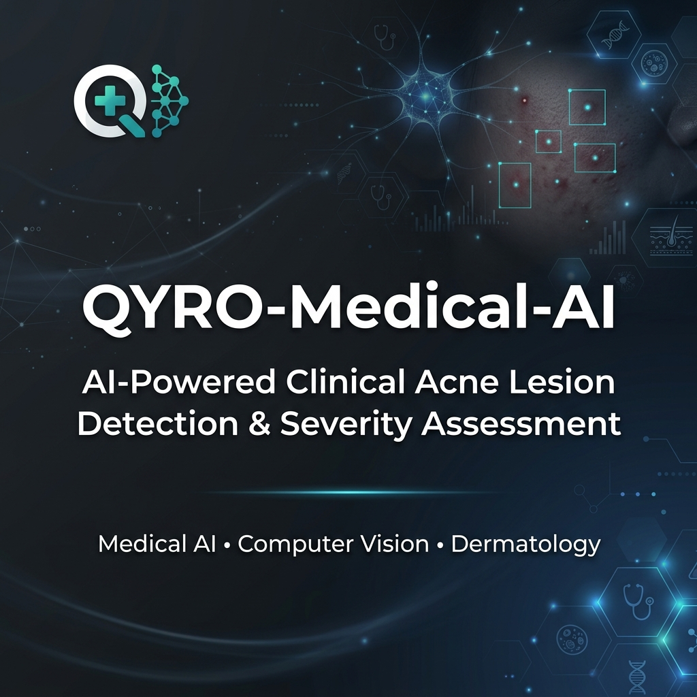
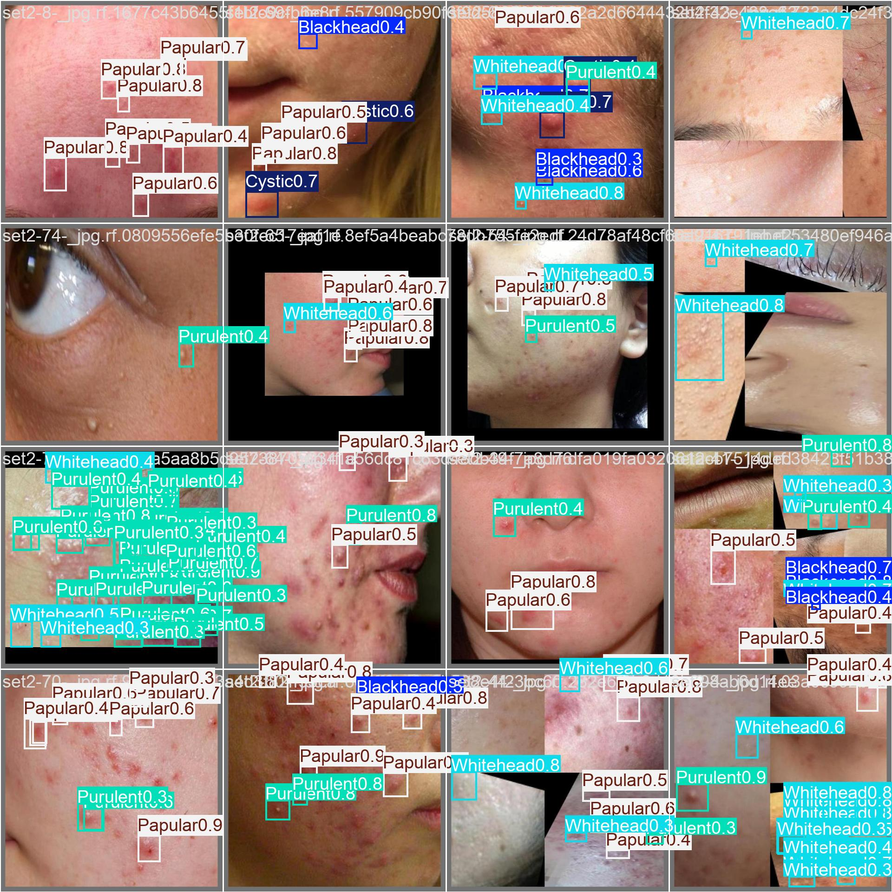
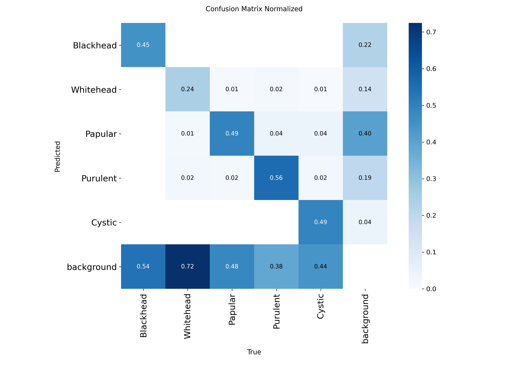
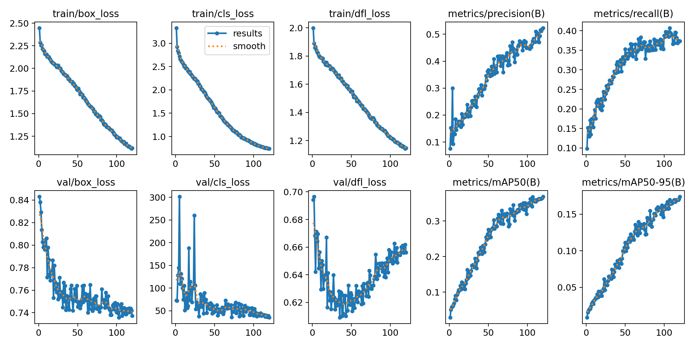

# QYRO-Medical-AI

### AI-Powered Clinical Acne Lesion Detection & Severity Assessment

[](https://www.python.org/)
[](https://github.com/ultralytics/ultralytics)
[]()
[]()
[](file:///c:/Users/KARTHIK%20V/OneDrive/Desktop/Qyro-Acne/temp_research_repo/LICENSE_NOTICE.md)

> ⚠️ **Research in Progress**
> 
> This repository documents an active medical AI research project.
> It is intended for academic collaboration, dataset documentation, and reproducible research.
> 
> Source code, trained models, and proprietary components are intentionally excluded.

---

## 1. Project Overview

Acne vulgaris is one of the most common dermatological conditions globally, yet its clinical assessment remains subject to high inter-observer variability. Traditional severity staging systems, such as the Investigators Global Assessment (IGA), rely on qualitative, holistic assessments that can lead to inconsistent diagnoses and subjective treatment decisions.

**QYRO Medical AI** is an experimental research project exploring how computer vision and hybrid reasoning can standardize acne lesion detection and stage severity. By combining **YOLO-based object detection** with a clinical reasoning layer, QYRO aims to deliver precise, explainable, and reproducible assessments.

### Key Focus Areas
* **Lesion-Level Detection:** Moving beyond image-level classification to localize and identify individual lesion subtypes (*Blackheads*, *Whiteheads*, *Papules*, *Pustules*, and *Cysts*).
* **Clinical Severity Staging:** Calibrating raw object detection bounding boxes with total surface area metrics to prevent macro close-up bias.
* **Explainable AI (XAI):** Presenting staging recommendations based on clinical rules rather than black-box decision boundaries.
* **Research-First Pipeline:** Standardizing data curation, provenance tracking, and annotation quality audits.

---

## 2. Current Research Focus

Our current research efforts are focused on the following areas:
* **Acne lesion detection:** Enhancing multi-class detection accuracy for dense, overlapping lesions.
* **Clinical dataset curation:** Auditing, cleaning, and labeling diverse dermatological image datasets.
* **Annotation quality assurance:** Identifying and removing labeling errors, noise, and out-of-boundary bounding boxes.
* **Explainable AI:** Structuring reasoning rules that map lesion distributions to severity stages transparently.
* **Dataset provenance:** Preserving tracking histories from raw source downloads to model-ready training partitions.
* **Severity assessment:** Normalizing counts by surface area to calibrate classification predictions.
* **Multi-source dataset harmonization:** Standardizing different class indexes, annotations, and aspect ratios from diverse sources.

---

## 3. Architecture

The QYRO Medical AI architecture separates raw image data ingestion, processing, and clinical staging into a structured research workflow:

```
    Medical Images
          │
          ▼
   Dataset Factory
          │
          ▼
   Clinical Mapping
          │
          ▼
  Quality Validation
          │
          ▼
    Merged Dataset
          │
          ▼
    YOLO Training
          │
          ▼
 Clinical Evaluation
          │
          ▼
         QYRO
```

---

## 4. Dataset Factory Pipeline

The QYRO Dataset Factory utilizes a strict, multi-stage processing pipeline to ensure data quality and integrity before model training:

```
  Raw Dataset
       │
       ▼
     Import
       │
       ▼
  Clinical Mapping
       │
       ▼
  Annotation Audit
       │
       ▼
  Quality Analysis
       │
       ▼
  YOLO Agreement Validation
       │
       ▼
    Deduplication
       │
       ▼
  Candidate Dataset
       │
       ▼
   Merged Dataset
       │
       ▼
    Training
```

* **Raw Dataset Ingestion:** Importing multi-source clinical and open-source datasets in native formats.
* **Annotation Audit:** Programmatic analysis of label counts, formatting errors, and boundary violations.
* **Clinical Mapping:** Standardizing class labels across different naming conventions (e.g., remapping generic labels to specific acne subtypes).
* **Quality Analysis:** Checking for corrupted images, color/exposure distribution anomalies, and resolution padding biases.
* **YOLO Agreement Validation:** Cross-checking training labels against pre-trained weights to flag extreme outlier annotations.
* **Deduplication:** Hashing files (using MD5) to identify and safely remove duplicate images, preventing data leakage between train/test splits.
* **Candidate Selection:** Retaining negative (background) samples to reduce False Positives while pruning noisy and unrelated classes.
* **Merged Dataset & Training:** Compiling clean, version-controlled records ready for YOLO training.

---

## 5. Development Status

### Core Engine Status
- [x] Dataset Factory v1.0
- [x] Clinical Mapping Engine
- [x] Annotation Audit Engine
- [x] Image Quality Engine
- [x] YOLO Agreement Validation
- [x] Candidate Dataset Generation
- [x] Dataset Versioning
- [x] Provenance Tracking
- [ ] Multi-Dataset Training
- [ ] Ensemble Models
- [ ] Clinical Validation
- [ ] External Benchmark
- [ ] Production API

### Dataset Integration Matrix
We track dataset integration status using a strict progress matrix:

| Dataset ID | Dataset Name | Status | Status Code |
| :--- | :--- | :---: | :---: |
| **DS001** | Roboflow Acne Detection Dataset | ✅ Completed | `ACTIVE_TRAIN` |
| **DS002** | Kaggle Acne Type Dataset | ✅ Completed | `ACTIVE_EVAL` |
| **DS003** | ACNE04 Dataset | ✅ Completed | `ACTIVE_EVAL` |
| **DS004** | Stage-Labelled Clinical Dataset | ⏳ Pending | `PENDING_REVIEW` |
| **DS005** | ISIC Dermatology Archive | ⏳ Pending | `PENDING_CLEAN` |
| **QYRO-CL**| QYRO Clinical Dataset | 🚧 Work in Progress | `IN_CURIOSITY` |

---

## 6. Project Statistics

Below are the latest verified statistics from the Dataset Factory and model runs:

* **Datasets processed:** 3
* **Images ingested:** 14,020+
* **Accepted candidate images:** 426
* **Dataset Factory Version:** 1.0
* **Calibration Version:** T45
* **Merged candidate pool:** 426 images
* **Public datasets completed:**
  * ✔ DS001 (Roboflow Acne Detection Dataset)
  * ✔ DS002 (Kaggle Acne Type Dataset)
  * ✔ DS003 (ACNE04 Dataset)

---

## 7. Upcoming Milestones

- [x] Dataset Factory v1.0
- [x] Dataset Processing
- [ ] Integrate Acne04-v2
- [ ] Acquire AcneSCU
- [ ] Acquire AcnePKUIH
- [ ] Merge QYRO Dataset v2
- [ ] Production Training
- [ ] Clinical Validation
- [ ] REST API
- [ ] Explainable AI
- [ ] Mobile Deployment

---

## 8. Visual Assets & Training Diagnostics

To ensure transparency and reproducibility in model diagnostics, the pipeline logs performance curves, annotation validation batches, and classification confusion matrices:

### YOLO Validation Bounding Box Overlays
Validation batch predictions displaying individual bounding boxes mapping to the 5 clinical lesion subclasses (*Blackhead*, *Whitehead*, *Papular*, *Purulent*, *Cystic*):


### Normalised Confusion Matrix
Per-class classification accuracy showing strong agreement on localized subclasses:


### Training Results Progress Curves
Progress of bounding box precision, recall, and mean Average Precision (mAP50 / mAP50-95) metrics across epochs:


---

## 9. Medical AI Principles

Our development roadmap is guided by a set of core principles that prioritize patient safety and scientific rigor:

* **Human-in-the-Loop:** Designed to assist, not replace, dermatologists. Every automated triage recommendation points back to verifiable clinical staging criteria.
* **Dataset Provenance:** Ensuring full traceability of training images, from raw format to cleaned partitions, preventing opaque data bias.
* **Clinical Traceability:** Documenting exactly how AI-generated box densities map to severity categories (e.g., clear, comedonal, mild, moderate, severe).
* **Reproducibility:** Utilizing fixed seed counts, deterministic pipelines, and explicit augmentation constraints.
* **Responsible AI:** Restricting patient identifiers, filtering private metadata, and assessing skin tone and demographic representation to prevent diagnostic bias.

---

## 10. Repository Structure

Only the public research documentation, pipeline schemas, and report graphics are tracked in this repository:

```
qyro-medical-ai-research/
├── docs/                             # Dataset audits and cleaning reports
│   ├── dataset_audit_plan.md         # Framework for checking data integrity
│   ├── dataset_audit_report.md        # Comprehensive raw dataset review
│   ├── dataset_cleaning_report.md     # Post-pruning and remapping metrics
│   ├── dataset_registry.md           # Master registry of integrated datasets
│   ├── qyro_repo_banner.png          # Repository branding banner
│   ├── yolo_v2_results.png           # Model training metrics curves
│   ├── confusion_matrix.png          # Normalised classification matrix
│   └── val_batch0_pred.jpg           # Annotation overlays on validation images
├── CITATION.cff                      # Academic citation metadata
├── CONTRIBUTING.md                   # Collaboration and coding standards
├── LICENSE_NOTICE.md                 # Public documentation license notice
├── ROADMAP.md                        # Milestones toward clinical validation
├── SECURITY.md                       # Disclosure and patient safety protocols
└── README.md                         # This file
```

---

## 11. Publications

* **No peer-reviewed publications yet.** 
* The research is currently under active development. Future publications and paper companions will be listed here.
* Key foundational research and datasets that influenced this workflow include:
  * *AcneAI* (MICCAI 2024)
  * *ACNE04* (ICCV 2019)

---

## 12. Future Collaboration

We welcome collaboration from the scientific and clinical communities:
* 🩺 **Dermatologists:** To provide validation feedback on our clinical reasoning staging logic.
* 🎓 **Academic Researchers & Universities:** To co-author studies on explainable diagnostic pipelines.
* 📂 **Dataset Owners & Providers:** To expand the demographic representation of our training pools.
* 💻 **Medical AI Contributors:** To peer-review dataset validation pipelines and schemas.

If you are interested in collaborating, please open an issue or refer to [CONTRIBUTING.md](file:///c:/Users/KARTHIK%20V/OneDrive/Desktop/Qyro-Acne/temp_research_repo/CONTRIBUTING.md).

---

## 13. Dataset Acknowledgements

This research benefits significantly from publicly available dermatology datasets released by the respective authors. We sincerely thank the original creators for their dedication to advancing medical AI research and open clinical benchmarks.

---

## 14. Citation

If you use this repository or its documented research approach in academic work, please cite the repository using the GitHub **"Cite this repository"** feature or copy the metadata from [CITATION.cff](file:///c:/Users/KARTHIK%20V/OneDrive/Desktop/Qyro-Acne/temp_research_repo/CITATION.cff).

---

## 15. Disclaimer

> ⚠️ **Disclaimer**
> 
> This repository documents an active research project. It is **NOT** intended for clinical diagnosis, prognosis, or treatment. 
> 
> The tools and information described here are designed for research collaboration only. All clinical decisions must remain with licensed healthcare professionals.
